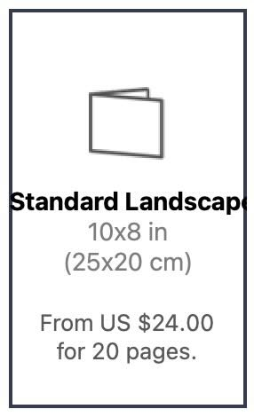
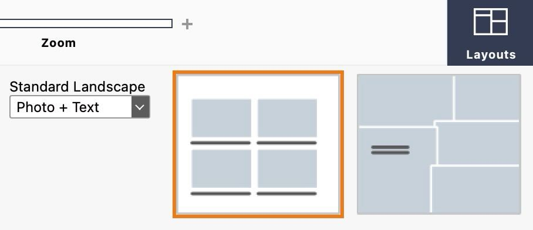
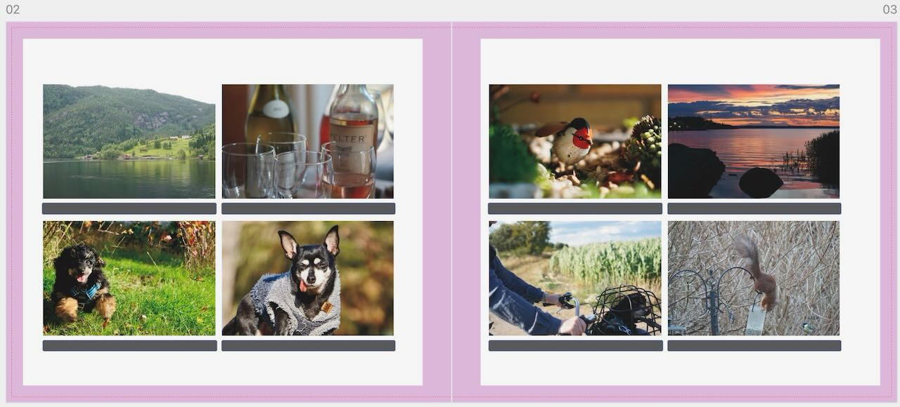
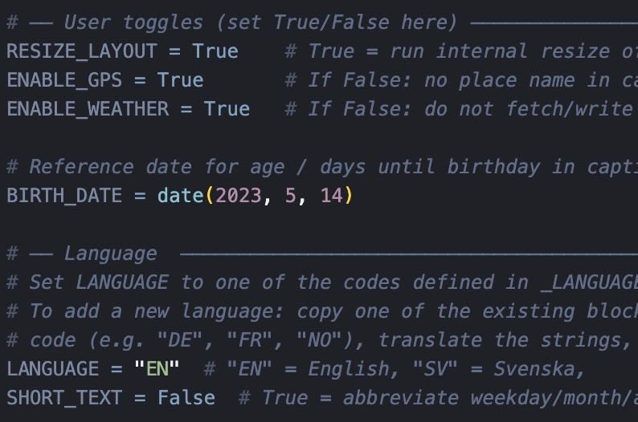
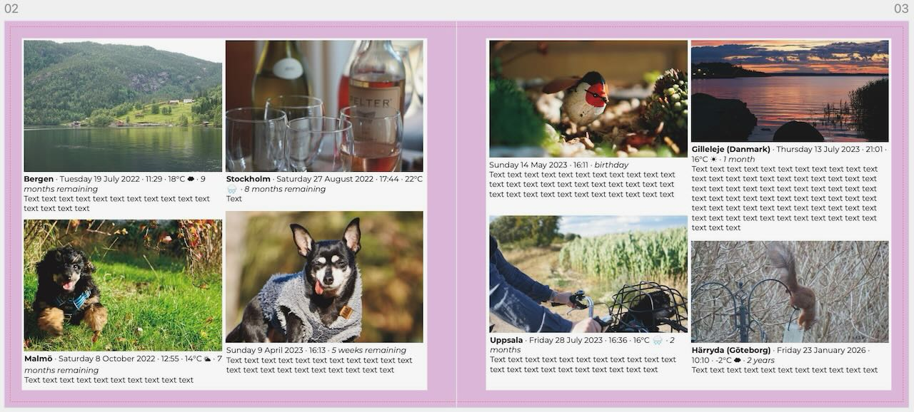
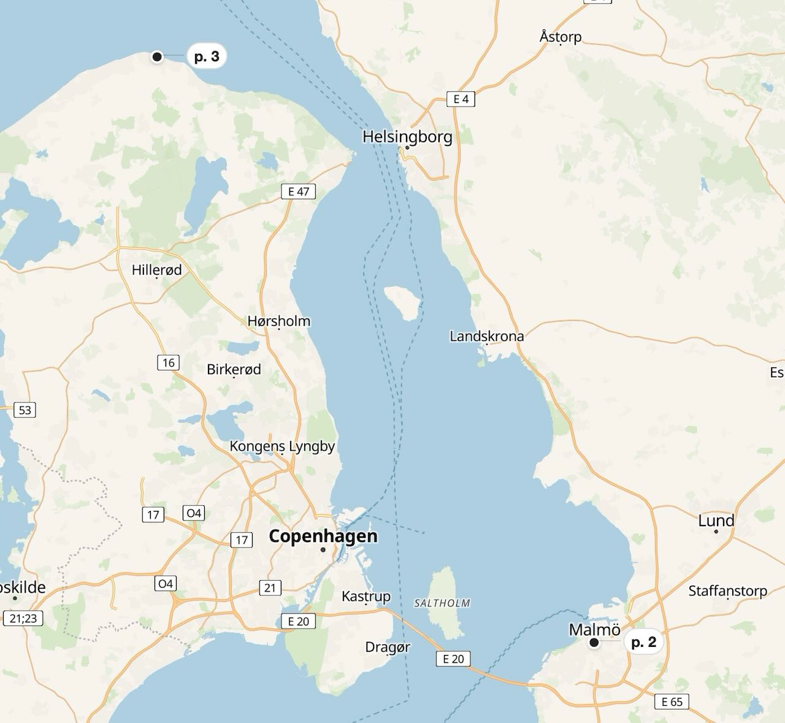

# Blurb_tool

I wanted my photo books to include dates, locations, and captions — the kind of thing I miss when I look through old family albums. The problem is that adding all that manually in BookWright takes forever. I already have all that information in Apple Photos.

So I had AI write a couple of Python scripts to solve this for myself. Maybe they're useful to you too. I'm a photographer and a father, not a developer.

---

## What it does

**`blurb_captions.py`** reads your `.blurb` file directly, pulls EXIF data (EXIF ImageDescription, **not** IPTC or XMP) from the photos inside it, looks up the place name and weather via API, and writes captions into the text boxes on each page. It **does not change the file you pass in**. Instead it copies it to a new file next to it: if your book is `album.blurb`, the result is **`album-new.blurb`**. Open that one in BookWright.

A caption ends up looking something like this:

```
Stockholm · tue 15 Jul 2025 · 14:30 · 22°C ☀︎ · 8 months
First visit at the beach, 
```

You can turn each part on or off (place, weather, age), choose **Swedish or English** for the date and age line (`CAPTION_LANG`), and choose short or full weekday/month words (`ABBREVIATE_TEXT`).

**`csv_to_map.py`** takes the sidecar CSV the first script creates and builds a single-page HTML map showing where each photo was taken, with book page numbers as markers. Nice for remembering where everything was shot.

The map works out of the box without any API key, using free [OpenFreeMap](https://openfreemap.org/) styles (Liberty, Bright, Positron). If you have a [MapTiler](https://cloud.maptiler.com/) key you can pass it in to unlock asnd make custom maps.

---

## What you need

- Python 3.9 or later
- BookWright 3.4.0 (what I tested with)
- A Standard Landscape book with 4 photos and 4 text boxes per page

---

## Installation

```bash
cd Blurb_tool
python3 -m venv .venv
source .venv/bin/activate
pip install -r requirements.txt
```

---

## Setting up your book in BookWright

**1. Create a Standard Landscape book**



**2. Apply this layout to your pages**



**3. Auto-place all your photos — it should look like this**



---

## Running it

**4. Set your preferences near the top of the script**



```bash
python3 blurb_captions.py path/to/book.blurb
python3 csv_to_map.py path/to/album.csv
```

The first time you run `blurb_captions.py` it needs to look up place names and weather online, so it can be slow for large books (roughly 1–2 seconds per photo). After that it caches everything in a CSV file next to your book (`album.csv` for `album.blurb`), so subsequent runs are much faster.

Running `python3 blurb_captions.py album.blurb` overwrites **`album-new.blurb`** on each run and updates **`album.csv`** (the original `.blurb` is left unchanged).

**5. Open `album-new.blurb` in BookWright — captions are filled in**



**6. Run `csv_to_map.py` to get an interactive map of where each photo was taken, with page numbers as markers**



### Map with MapTiler styles

To use MapTiler styles (satellite, outdoor, streets, etc.) or your own custom map, pass your API key:

```bash
python3 csv_to_map.py path/to/album.csv --maptiler-key YOUR_KEY
```

Without the key, the map still works with three free OpenFreeMap styles.

---

## Settings

Near the top of `blurb_captions.py` you'll find a few toggles:

| Setting | What it does |
|--------|--------------|
| `RESIZE_LAYOUT` | Automatically adjusts photo and text box sizes on each page |
| `ENABLE_GPS` | Show the place name in the caption |
| `ENABLE_WEATHER` | Show weather in the caption |
| `BIRTH_DATE` | Set a birthday to get age or countdown text per photo |
| `CAPTION_LANG` | `"EN"` or `"SV"` — language for the **date** and **age/countdown** line (not the caption from EXIF). See comments in the script for example phrases. |
| `ABBREVIATE_TEXT` | Short weekday/month (`Tue` / `Jul`) vs full words |

Near the top of `csv_to_map.py`:

| Setting | What it does |
|--------|--------------|
| `DEFAULT_STYLE` | Which map style to open with (`"liberty"`, `"bright"`, or `"positron"` for free styles; MapTiler style names if using a key) |
| `MAPTILER_CUSTOM_MAP_ID` | Your custom MapTiler map ID (replace `0123` with your own) |
| `PIN_LINE_WIDTH` | Length of the line from the dot to the page label in pixels. Set to `0` to hide |
| `CLUSTER_CHARS_PER_LINE` | Max characters per line in clustered page number labels |

---

## The CSV

After the first run, a CSV file appears next to your book (same base name as the input `.blurb`, e.g. `album.csv` for `album.blurb`). You can edit it to fix place names or add locations for photos without GPS. The script will never overwrite values you've entered yourself.

---

## Known issues

- **Photo frame fill/fit** — after opening `-new.blurb`, you'll need to manually adjust each photo's fill or fit setting in BookWright. The script doesn't touch this.
- **Thumbnails don't update** — page thumbnails in BookWright won't refresh until you make a change on each page.

---

## License

Public domain ([The Unlicense](https://unlicense.org/)). Do whatever you want with it.

---

## Contributing

Issues and pull requests are welcome — I'm not a developer, just a photographer who got tired of doing this by hand.